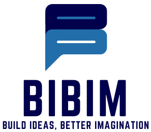
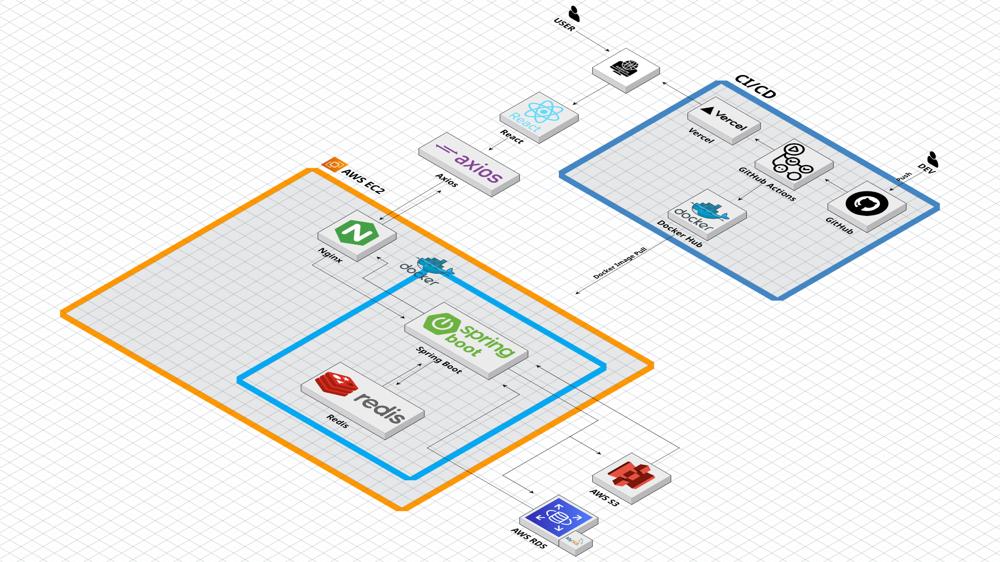
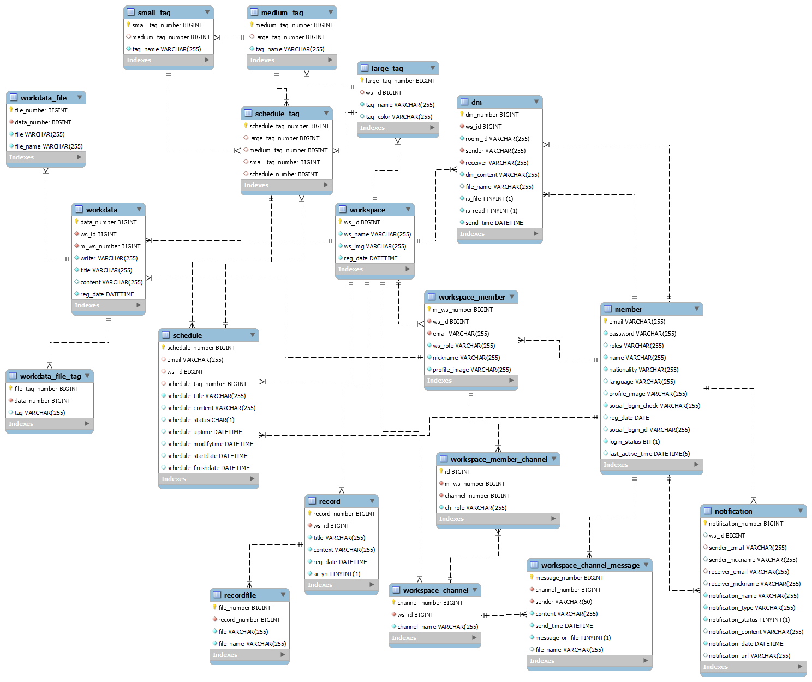

  

  <h1> 🫱‍🫲 Bibim (다국적 협업툴 서비스) 🌍 </h1>
  
  
  
  

 

## 📚 목차

### 1. [**서비스 개요**](#서비스-개요)
### 2. [**기술 스택**](#기술-스택)
### 3. [**주요 기능**](#주요-기능)
### 4. [**시스템 아키텍처 & DB**](#시스템-아키텍처--db)
### 5. [**프로젝트 기간**](#프로젝트-기간)
### 6. [**팀원 소개**](#팀원-소개)

---

## 1️⃣ 서비스 개요

**다국적 협업의 장벽을 허물다, Bibim**

> 다양한 국적과 언어를 사용하는 사람들이 원활히 협업할 수 있도록 돕는 협업 플랫폼  
> 채팅, 스케줄 관리, 자료 공유를 하나의 플랫폼에 통합하여 협업 효율성 증대

- 기존 협업툴의 단점 보완  
  - Notion → 실시간 채팅 부재  
  - Discord → 일정 관리와 자료 정리가 어려움
- Bibim은 이를 하나로 통합한 All-in-One 협업툴

---

## 2️⃣ 기술 스택

### 🖥 Frontend

| React | Redux | JavaScript | Vite | MUI | Axios | React Router |
| :---: | :---: | :--------: | :--: | :-: | :---: | :----------: |

### 🛠 Backend

| Java | SpringBoot | Spring Security | JPA | JWT | MySQL | Redis |
| :--: | :--------: | :-------------: | :-: | :-: | :---: | :---: |

### ☁ DevOps & Infra

| Docker | GitHub Actions | AWS EC2 | S3 | Railway | Vercel | Nginx |
| :----: | :-------------: | :-----: | :-: | :-----: | :----: | :---: |

---

## 3️⃣ 주요 기능

- **스마트 협업 공간 (워크스페이스)**  
  - 초대 코드 기반 참여 / 프로필별 공간 분리 / 권한 관리  
- **일정 관리**  
  - 캘린더, 간트차트, 칸반보드  
  - 태그 기능 및 상태/담당자 관리  
- **자료실**  
  - 테이블/카드뷰 제공, 태그 필터링, 검색 및 정렬, S3 기반 파일 업로드  
- **마이페이지**  
  - 내 일정/자료 모아보기, 시간대 자동 반영, 참여중인 워크스페이스 관리  
- **번역 기능**  
  - 설정된 언어 기준 자동 번역 (채팅)

---

## 4️⃣ 시스템 아키텍처 & DB

### 🔧 아키텍처

  

### 📘 ERD

  

---

## 5️⃣ 프로젝트 기간

> **2025.01.16 ~ 2025.03.21**  
SCIT 개발자 과정 팀 프로젝트

---

## 6️⃣ 팀원 소개

| 이름 | 역할 | 주요 담당 |
| ---- | ---- | -------- |
| 임성준 (팀장) | 풀스택 | 프론트 UI 구현 / 백엔드 API 및 DB 설계 / API 명세서 작성 |
| 진환 | 풀스택 | 캘린더 기능, 백엔드 통신 |
| 상준 | 풀스택 / 인프라 | Redis 및 SSE, 배포 구성 |
| 경남 | 풀스택 | 소켓 채팅 기능 |
| 세빈 | 풀스택 / 디자인 | Figma 기반 디자인, DM 구현 |
| 경진 | 백엔드 | DB 구축, 워크스페이스 / 채널 API |

---

> 📌 Notion, 시연 영상, 배포 링크가 있다면 아래와 같이 추가:

- [📘 기획 Notion 바로가기](https://example.notion.site)
- [🎥 UCC 시연 영상 보러가기](https://youtu.be/example)
- [🚀 배포 링크 (클릭)](https://bibim.live)

