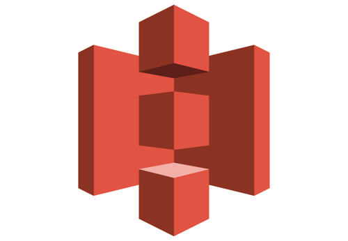

  

  <h1> 🫱‍🫲 Bibim (다국적 협업툴 서비스) 🌍 </h1>

   

<!-- Frontend -->
  
  
  
  
 

<!-- Backend -->
  
  
  
  
  
 

<!-- Infra -->
  
  
  
  
 

<!-- Collaboration -->
  
  
  
 

 

## 📚 목차

### 1. [**서비스 개요**](#1)
### 2. [**기술 스택**](#2)
### 3. [**주요 기능**](#3)
### 4. [**시스템 아키텍처 & DB**](#4)
### 5. [**프로젝트 기간**](#5)
### 6. [**팀원 소개**](#6)
### 7. [**프로젝트 시연 영상**](#7)

 

---

## 1️⃣ 서비스 개요

**다국적 협업의 장벽을 허물다, Bibim**

> 다양한 국적과 언어를 사용하는 사람들이 원활히 협업할 수 있도록 돕는 협업 플랫폼  
> 채팅, 스케줄 관리, 자료 공유를 하나의 플랫폼에 통합하여 협업 효율성 증대

- 기존 협업툴의 단점 보완  
  - Notion → 실시간 채팅 부재  
  - Discord → 일정 관리와 자료 정리가 어려움
- Bibim은 이를 하나로 통합한 All-in-One 협업툴

 

---

## 2️⃣ 기술 스택

### 🖥 Frontend

|  |  |    |   |    |    |    |
| :---: | :---: | :--------: | :--: | :-: | :---: | :----------: |
| React | Redux | JavaScript | Vite | MUI | Axios | React Router |

### 🛠 Backend

|  |  |  |  |  |  |  |
| :--: | :--------: | :-------------: | :-: | :-: | :---: | :---: |
| Java | SpringBoot | Spring Security | JPA | JWT | MySQL | Redis |

### ☁ DevOps & Infra

|  |  |  |  |  |  |  |
| :----: | :-------------: | :-----: | :-: | :-----: | :----: | :---: |
| Docker | GitHub Actions | AWS EC2 | S3 | Railway | Vercel | Nginx |

 

---

## 3️⃣ 주요 기능

- **스마트 협업 공간 (워크스페이스)**  
  - 초대 코드 기반 참여 / 프로필별 공간 분리 / 권한 관리  
- **일정 관리**  
  - 캘린더, 간트차트, 칸반보드  
  - 태그 기능 및 상태/담당자 관리  
- **자료실**  
  - 테이블/카드뷰 제공, 태그 필터링, 검색 및 정렬, S3 기반 파일 업로드  
- **마이페이지**  
  - 내 일정/자료 모아보기, 시간대 자동 반영, 참여중인 워크스페이스 관리  
- **번역 기능**  
  - 설정된 언어 기준 자동 번역 (채팅)

 

---

## 4️⃣ 시스템 아키텍처 & DB

### 🔧 아키텍처

  

 

### 📘 ERD

  

 

---

## 5️⃣ 프로젝트 기간

> **2025.01.16 ~ 2025.03.21**  
SCIT 개발자 과정 팀 프로젝트

 

---

## 6️⃣ 팀원 소개

| 이름 | 역할 | 주요 담당 |
| ---- | ---- | -------- |
| 임성준 (팀장) | 풀스택 | 프로젝트 총괄 / 서비스 전반의 프론트엔드 설계 및 구현 / 백엔드 연동 |
| 진환 | 풀스택 | 일정관리,태그 기능 / 발표 |
| 상준 | 풀스택 / 인프라 | 일정관리 및 전반적인 백엔드, Redis 및 SSE, 배포 구성 |
| 경남 | 풀스택 | 자료실, 알림 기능 |
| 세빈 | 풀스택 / 디자인 | Figma 기반 디자인, 서비스 전반 프론트엔드 구현, 디테일 작업 |
| 경진 | 풀스택 | DB 구축, 워크스페이스 백엔드 / DM, 채널 기능 |

 

---

## 7️⃣ 프로젝트 시연 영상

>  ### 한글 자막

 

>  ### 일본어 자막 (日本語字幕)

 

> 새 창 열기 방법 : Ctrl + click (on Windows and Linux) | CMD + click (on MacOS)

 

 

---

> 📌 Notion, 배포 링크 :

- [📘 기획 Notion 바로가기](https://example.notion.site)
- [🚀 배포 링크 (클릭)](https://dev.bibim.shop)

